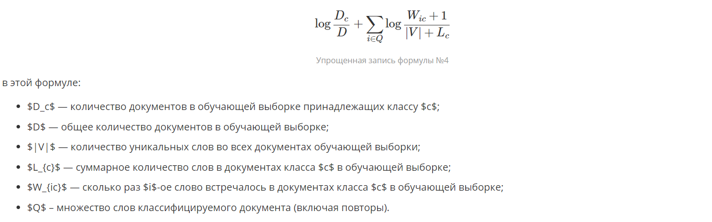

# Отчет по лабораторной работе
## по курсу "Искусственый интеллект"

## Классификация

### Студент: Сахарин Н.А.

## Результат проверки

| Преподаватель     | Дата         |  Оценка       |
|-------------------|--------------|---------------|
| Самир Ахмед       |              |               |

> *Комментарии проверяющих*

## Тема работы
  Реализовать алгоритм выявляющий взаимосвязанные сообщения на языке Python. Подобрать или создать датасет и обучить модель. Продемонстрировать зависимость качества кластеризации от объема, качества выборки и числа кластеров. Продемонстрировать работу вашего алгоритма. Обосновать выбор данного алгоритма машинного обучения. Построить облако слов для центров кластеров(wordcloud).

## Отчет по ходу работы
  Рассматриваемую задачу можно поделить на три части.
  1) Алгоритм классификации.

Название членов реализованного класса соответствует обозначениям формулы. Кроме того, в коде программы присутствуют содержательные коментарии.
  2) Обработка исходного текста, получение матрицы признаков (feature matrix) и вектора классов. Изначально задан список текстов. Для каждого текста известно, содержит от негативный отзыв (в алгоритме программы обозначается 0) или позитивный (обозначается 1). Таким образом каждому тексту поставлен в соответствие один из двух классов. Для каждого слова в тексте необходимо выделить главную часть. Так, например, словa 'значимо', 'значимый' и 'значимость' должны выражаться в результирующей матрице одним столбцом, а не тремя. Так как мы будем пользоваться предположением, которые упрощенно можно выразить так - однокоренные слова близкие по смыслу представляют из себя один и тот же принак. Таким образом, обработка текста включает в себя стемминг (stemming).
```python
from nltk.stem.snowball import SnowballStemmer
>>> st = SnowballStemmer('russian')
>>> st.stem('значение')
'значен'
>>> st.stem('значимость')
'значен'
>>> st.stem('значимый')
'значим'
```
Еще одна важная особенность, которую нам требуется учесть - стоп слова (stop words). Упрощенно их можно описать, как такие слова, которые не несут существенного значения - предлоги, местоимения, наиболее частоупотребляемые наречия. Например:
```python
>>> from nltk.corpus import stopwords
>>> stopwords.words('russian')
\['и', 'в', 'во', 'не', 'что', 'он', 'на', 'я', 'с', 'со', 'как', 'а', 'то', 'все', 'она', 'так', 'его', 'но', 'да', 'ты', 'к', 'у', 'же', 'вы', 'за', 'бы', 'по', 'только', 'ее', 'мне', 'было', 'вот', 'от', 'меня', 'еще', 'нет', 'о', 'из', 'ему', 'теперь', 'когда', 'даже', 'ну', 'вдруг', 'ли', 'если', 'уже', 'или', 'ни', 'быть', 'был', 'него', 'до', 'вас', 'нибудь', 'опять', 'уж', 'вам', 'ведь', 'там', 'потом', 'себя', 'ничего', 'ей', 'может', 'они', 'тут', 'где', 'есть', 'надо', 'ней', 'для', 'мы', 'тебя', 'их', 'чем', 'была', 'сам', 'чтоб', 'без', 'будто', 'чего', 'раз', 'тоже', 'себе', 'под', 'будет', 'ж', 'тогда', 'кто', 'этот', 'того', 'потому', 'этого', 'какой', 'совсем', 'ним', 'здесь', 'этом', 'один', 'почти', 'мой', 'тем', 'чтобы', 'нее', 'сейчас', 'были', 'куда', 'зачем', 'всех', 'никогда', 'можно', 'при', 'наконец', 'два', 'об', 'другой', 'хоть', 'после', 'над', 'больше', 'тот', 'через', 'эти', 'нас', 'про', 'всего', 'них', 'какая', 'много', 'разве', 'три', 'эту', 'моя', 'впрочем', 'хорошо', 'свою', 'этой', 'перед', 'иногда', 'лучше', 'чуть', 'том', 'нельзя', 'такой', 'им', 'более', 'всегда', 'конечно', 'всю', 'между'\]
```
  3) После того, как полученна матрица признаков и вектор классов разделим входные данные для обучения и проверки. А затем применим к полученным данным собственную реализацию классификатора, а также библиотечную, в результате чего получим следующие результаты:
```python
[nltk_data] Downloading package movie_reviews to
[nltk_data]     /home/nikita/nltk_data...
[nltk_data]   Package movie_reviews is already up-to-date!
[nltk_data] Downloading package stopwords to /home/nikita/nltk_data...
[nltk_data]   Package stopwords is already up-to-date!
naive bayes classifier:
accuracy_score = 0.8216666666666667

sklearn.naive_bayes.MultinomialNB:
accuracy_score = 0.82

```

## Выводы
  'Наивность' классификатора заключается в том, что он игнорирует тот факт, что в натуральном языке вероятность появления слова сильно зависит от контекста. Байесовский же классификатор представляет документ как набор слов вероятности которых условно не зависят друг от друга. Этот подход иногда еще называется bag of words model.
  Другой важной деталью является то, что реализованный алгоритм, как это можно установить из сравнения с ```sklearn.naive_bayes.MultinomialNB```, по крайней мере не уступает ему по точности. А на представленном примере имел точность даже выше.
  Так же стоит заметить, что на данный момент существуют более эффективные методы классифификации, так кроме сервиса для анализа эмоций лица на фотографии, когнитивные сервисы компании Microsoft также предлагают возможности по анализу естественных языков.
